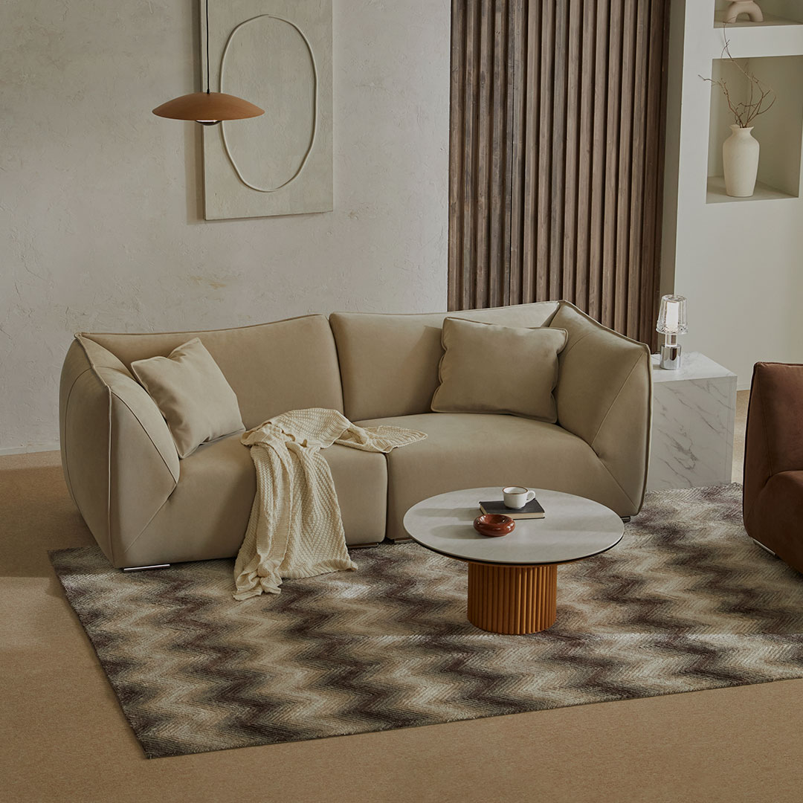

# codereview
셀프 리뷰&피드백

# ✨ NEEZ Clone Project
#### 프로젝트 소개

반응형 웹사이트 모작  
기술 : HTML, SCSS (css), JavaScript, JQUERY
프로그램 : 피그마, 비주얼스튜디오코드  
링크 : https://yejiiiiiiii.github.io/NEEZ/

---

## 🔍 Self Review

### 📁 1. 파일 구조 및 구성
- [x] 역할별 디렉토리 분리 (/css, /js, /images)  
- [x] 인라인 스타일 및 스크립트 제거 → 모든 CSS/JS 외부 파일로 분리  
- [x] SCSS 모듈화 및 파일 네이밍 일관성 유지  
- [ ] CSS 커스텀 프로퍼티 도입 고려 (다크 모드 및 테마 확장 대비)  
---

### 🧱 2. HTML 리뷰
```html
<header class="header">
        <div class="inner">
            <h1 class="logo">
                
            </h1><!-- .logo end -->
            <nav class="nav_pc pc">
                <ul class="gnb">
                    <li>
                        <a href="#" class="depth-01">ABOUT</a>
                        <ul class="depth-02">
                            <li><a href="#">ABOUT NEEZ</a></li>
                            <li><a href="#">CI</a></li>
                            <li><a href="#">ESG</a></li>
                            <li><a href="#">HISTORY</a></li>
                        </ul><!-- .depth-02 end -->
                    </li>
                    <!-- 이하 생략 -->
                </ul><!-- .gnb end -->
            </nav><!-- .nav_mobile mobile end -->
        </div><!-- .inner end -->
    </header><!-- .header end -->

    <main class="main">
        <div class="scroll">
            <div class="button_wrap">
                <button type="button" class="kakao-btn">
                    <a href="#">
                        
                    </a>
                </button>
                <button type="button" class="top-btn">
                    
                </button>
            </div><!-- .button_wrap end -->
        </div><!-- .scroll end -->

        <section class="main_visual">
            <div class="swiper main-swiper">
                <div class="swiper-wrapper">
                    <div class="swiper-slide slide-01"></div>
                    <div class="swiper-slide slide-02"></div>
                    <div class="swiper-slide slide-03"></div>
                    <div class="swiper-slide slide-04"></div>
                </div>
            </div>
        </section><!-- .main_visual end -->

        <section class="section section-01">
            <div class="inner">
                <div class="grid-box">
                    <div class="image_box">
                        <div class="image">
                            
                        </div><!-- .image end -->
                        <div class="text">
                            <p>Provides Value Beyond the Product</p>
                            <a href="#" class="more">
                                <p class="info">
                                    More Info
                                </p><!-- .text end -->
                            </a><!-- .more end -->
                        </div><!-- .text end -->
                    </div><!-- .image_box end -->

                    <div class="item_wrap">
                        <div class="item">
                            <a href="#">
                                
                                <p>디에즈 모듈</p>
                                <span class="cost">
                                    10,600,000원
                                </span>
                                <div class="discounted">
                                    8,480,000원
                                    <span>20%</span>
                                </div><!-- .discounted end -->
                            </a>
                        </div><!-- .item end -->
                        <!-- 이하 상품 카드 반복 -->
        </section>
        <!-- 이어서 FEELIV, REVIEW, STORE, FOOTER 등 -->
    </main>


    <footer class="footer">
        <div class="inner">
            <div class="flex_box">
                <div class="left">
                    <div class="logo">
                        
                    </div><!-- .logo end -->
                    <div class="footer-info">
                        <ul>
                            <li>상호: (주)피앤엘</li>
                            <li>대표: 이경수</li>
                            <li>사업자등록번호: 177-88-00399</li>
                            <li>통신판매업신고번호: 2017-고양일산동-1380</li>
                            <li>주소: 경기도 고양시 일산동구 감내길 51</li>
                            <li>이메일:
                                <a href="mailto">neez@pnltrading.co.kr</a>
                            </li>
                        </ul>
                    </div><!-- .footer-info end -->
                    <div class="footer-info">
                        <ul>
                            <li>고객센터: 1588-5083</li>
                            <li>상담시간: 10:00~17:00 (월~금 / 공휴일 제외)</li>
                        </ul>
                    </div><!-- .footer-info end -->
                    <div class="footer-copyright">
                        © (주)피앤엘 ALL RIGHTS RESERVED.
                    </div><!-- .footer-copyright end -->
                </div><!-- .left end -->

                <div class="right">
                    <nav class="sitemap">
                        <ul>
                            <li><a href="#">ABOUT</a></li>
                            <li><a href="#">MATERIAL</a></li>
                            <li><a href="#">PRODUCT</a></li>
                            <li><a href="#">REVIEW</a></li>
                            <li><a href="#">STORE INFO</a></li>
                            <li><a href="#">EVENT</a></li>
                            <li><a href="#">CS CENTER</a></li>
                        </ul>
                    </nav><!-- .sitemap end -->
                </div><!-- .rigth end -->
            </div><!-- .flex_box end -->
        </div><!-- .inner end -->
    </footer><!-- .footer end -->
```
- [ ]  의미론적 태그 사용 강화
- `<section>`마다 id와 role="region", aria-labelledby 속성 추가 고려
- `<aside`>나 `<figure>` 등 적절한 시맨틱 태그 검토
- [ ]  Heading 태그 계층 순차화
- 메인 비주얼에서 `<h2>` 대신 `<h1>` 사용
- 섹션별 제목을 `<h2>` → `<h3>` → `<h4>`로 계층 재정리
- [ ] 모든 이미지에 alt 속성 적용
- [x] `<header>`, `<nav>`, `<main>`, `<footer>` 시맨틱 태그 제대로 활용
- [ ] 내비게이션 링크에 aria-current="page" 추가 → 현재 섹션 강조
- [x] 불필요한 래퍼 `<div>` 최소화
- 예: 로고 `<a>` 안에 별도 래퍼 대신 직접 `<a class="header__logo">`로 관리

---

### 🎨 3. CSS 리뷰

- [x] SCSS 모듈화 및 파일 분리
- [x] BEM 네이밍 일관성
- [x] 반응형 그리드 & 폰트 크기 조정: @media로 폰트 스케일링
- [ ] CSS 커스텀 프로퍼티 미도입: SCSS 변수와 병행해 :root { --primary-color: … } 선언 권장
- [x] 하드코딩된 색상·폰트 크기 변수화 필요 (color: #333333;, font-size: 1rem; 등)
- [ ] 공통 버튼 클래스 부재: .btn, .btn--primary, .btn--secondary 같은 유틸리티 클래스 생성 필요
- [ ] 중복 스타일 유틸리티 클래스 추출: .section02__cta, .section03__cta 등의 동일한 속성을 공통 클래스로 관리

---

### ⚙️ 4. JavaScript 리뷰
```javascript
// 메뉴 열기
$('.nav_btn').on('click', function () {
$('.nav_mobile').addClass('active');
$('.nav_btn').addClass('hidden'); // 클래스로 숨김 처리
});

// 메뉴 닫기
$('.close_btn').on('click', function () {
$('.nav_mobile').removeClass('active');
$('.nav_btn').removeClass('hidden'); // 다시 보여줌
});

// 아코디언 메뉴
$('.nav_mobile .depth-01').on('click', function (e) {
e.preventDefault();
const $this = $(this);
const $submenu = $this.next('.depth-02');

if ($submenu.is(':visible')) {
$submenu.slideUp();
$this.removeClass('active');
} else {
$('.nav_mobile .depth-02').slideUp();
$('.nav_mobile .depth-01').removeClass('active');
$submenu.slideDown();
$this.addClass('active');
}
});

// 탑 버튼
$('.top-btn').on('click', function () {
$('html, body').animate({ scrollTop: 0 }, 1000);
});

$(window).on('scroll', function () {
const scrollTop = $(window).scrollTop();
const footerTop = $('.footer').offset().top;
const windowHeight = $(window).height();

 if (scrollTop + windowHeight > footerTop) {
// 푸터에 닿으면 숨김
$('.scroll .button_wrap').fadeOut();
} else {
// 푸터 밖이면 다시 표시
$('.scroll .button_wrap').fadeIn();
}
});

// 메인 비주얼 슬라이더
const mainSwiper = new Swiper(".main-swiper", {
loop: true,
autoplay: {
delay: 2500,
disableOnInteraction: false
},
centeredSlides: true,
spaceBetween: 0
});

// 섹션 2 텍스트 슬라이드
const textSwiper = new Swiper(".textSwiper", {
direction: "vertical",
loop: true,
autoplay: {
delay: 3000,
disableOnInteraction: false,
},
on: {
slideChangeTransitionStart: function () {
const section = this.el.closest('.section-02');
if (!section) return;

const left = section.querySelector('.left');
const right = section.querySelector('.right');

gsap.to(left, { x: -30, opacity: 0.6, duration: 0.4, ease: "power1.out" });
gsap.to(right, { x: 30, opacity: 0.6, duration: 0.4, ease: "power1.out" });
},
slideChangeTransitionEnd: function () {
const section = this.el.closest('.section-02');
if (!section) return;

const left = section.querySelector('.left');
const right = section.querySelector('.right');

gsap.to(left, { x: 0, opacity: 1, duration: 0.5, ease: "power2.out" });
gsap.to(right, { x: 0, opacity: 1, duration: 0.5, ease: "power2.out" });
}
}
});
```

- [ ] DOM 요소를 한 번만 탐색해 변수에 저장 → 중복 탐색 최소화
- [ ] 의미 있는 함수명 사용: toggleMobileMenu(), toggleTopBtn()
- [x] IntersectionObserver 사용해 현재 섹션에 해당하는 메뉴 강조
- [x] requestAnimationFrame으로 스크롤 이벤트 최적화
- [ ] 함수 내부 로직을 더 작은 단위로 분리해 재사용성 향상
- [ ] DOM 요소 존재 여부 검증 추가 필요 (if (headerLogo) { … })
- [ ] 이벤트 리스너 해제 고려 (메모리 누수 방지)
- [ ] ES 모듈 분리 및 번들링(빌드 도구 도입) 검토

---

### 🎯 5. UX/UI 측면
- [x] 모바일 메뉴 토글(햄버거 아이콘) 정상 작동
- [x] 제품 카드 호버 시 확대(scale) 및 그림자 효과 → 명확한 시각적 피드백 제공
- [x] 상단 이동 버튼(Top Button)
- 현재 즉시 이동 → CSS scroll-behavior: smooth; 적용해 부드럽게 전환
- 스크롤 위치에 따라 버튼 노출/숨김 로직 추가
- [ ] 현재 메뉴 활성화 상태 시각화
- 스크롤 위치에 따라 .is-active, aria-current="page" 토글
- [ ] 모바일 메뉴 열림 시 배경 스크롤 잠금
- 메뉴 오버레이 상태에서는 <body> overflow: hidden; 처리 필요
- [x] CTA 버튼(“More Info”, “Store”) 대비 강화
- 배경색 대비, 호버 시 컬러 변화 등을 명확히 조정

---

## 🛠️ 개선 계획 (To-Do)
- [ ] HTML
- Heading 계층 재정리: `<h1>` → `<h2>` → `<h3>` 순으로 수정
- <section>마다 role="region" + aria-labelledby 속성 추가
- 내비게이션 링크에 aria-current="page" 토글 로직 보강
- 불필요한 <div> 래퍼 제거
- [ ] CSS/SCSS
- CSS 커스텀 프로퍼티(--primary-color, --text-color-dark, --bg-color-light 등) 도입
- 하드코딩된 색상·폰트 크기를 SCSS 변수로 대체
- 공통 버튼 클래스(.btn, .btn--primary, .btn--secondary) 생성
- 중복 스타일 유틸리티 클래스 추출
- 빌드 과정에서 CSS 압축 및 자동 벤더 프리픽스 적용(write-pfx)
- [ ] JavaScript
- 스크롤 핸들러 내부 로직 함수 분리 (예: fixNavbar(), unfixNavbar())
- DOM 요소 존재 여부 검증 추가
- 이벤트 리스너 해제 로직 고려
- ES 모듈 분리 후 빌드 도구(webpack, Rollup) 도입
- [ ] UX/UI
- 상단 이동 버튼 부드러운 스크롤 (scroll-behavior: smooth;) 적용
- 스크롤 위치에 따른 Top Button 노출/숨김 로직 추가
- 현재 메뉴 활성화 상태 표시 강화 (.is-active, aria-current)
- 모바일 메뉴 열림 시 배경 스크롤 잠금

---

## ✅ 참고 도구
- #VS Code: 코드 작성 및 SCSS 빌드(터미널 연동)
- #브라우저 개발자 도구 (Chrome DevTools):
  요소 검사(Element Inspector), CSS 수정 실시간 확인 /
  네트워크 탭(Network)으로 이미지·스크립트 로딩 상태 점검 /
  Performance 탭으로 렌더링 병목 확인 /
  Lighthouse로 기본 성능/접근성 보고서 확인
- #Figma: 원본 Neez 디자인 참조, 레이아웃·폰트·스페이싱 확인
- #GitHub Pages: 정적 파일 호스팅 및 배포 확인
